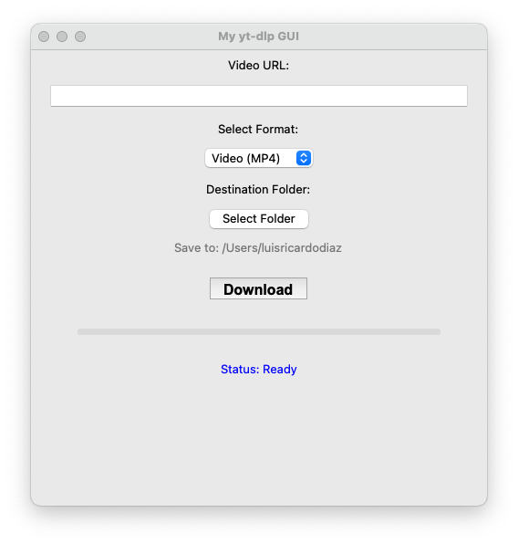

# Simple yt-dlp GUI

A lightweight graphical interface for [yt-dlp](https://github.com/yt-dlp/yt-dlp) built with Python and Tkinter. This tool allows you to easily download videos and extract MP3 audio from YouTube and other supported sites.

## Features

* 🎥 **Download Videos:** Save videos in MP4 format.
* 🎵 **Extract Audio:** Convert videos to MP3 automatically.
* 📂 **Custom Paths:** Select your preferred download folder.
* 📊 **Real-time Progress:** View download status and progress bars instantly.

## Prerequisites

To use the MP3 conversion feature, you must have **FFmpeg** installed and added to your system path.

* **macOS:**
    ```bash
    brew install ffmpeg
    ```
* **Windows:**
    [Download FFmpeg here](https://ffmpeg.org/download.html) and follow instructions to add it to your PATH.

## Installation

1.  **Clone the repository**
    ```bash
    git clone [https://github.com/YOUR_USERNAME/yt-dlp-gui.git](https://github.com/YOUR_USERNAME/yt-dlp-gui.git)
    cd yt-dlp-gui
    ```

2.  **Set up a Virtual Environment**

    * **macOS / Linux:**
        ```bash
        python3 -m venv venv
        source venv/bin/activate
        ```

    * **Windows:**
        ```bash
        python -m venv venv
        venv\Scripts\activate
        ```

3.  **Install Dependencies**
    ```bash
    pip install -r requirements.txt
    ```

## Usage

Once the dependencies are installed and the virtual environment is active, run the script:

```bash
python downloader_gui.py
# OR (depending on your system)
python3 downloader_gui.py

